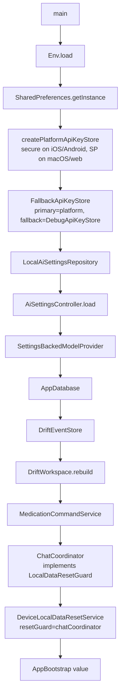
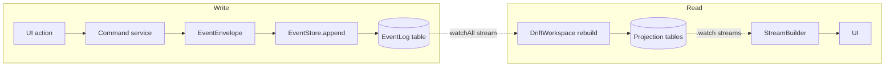
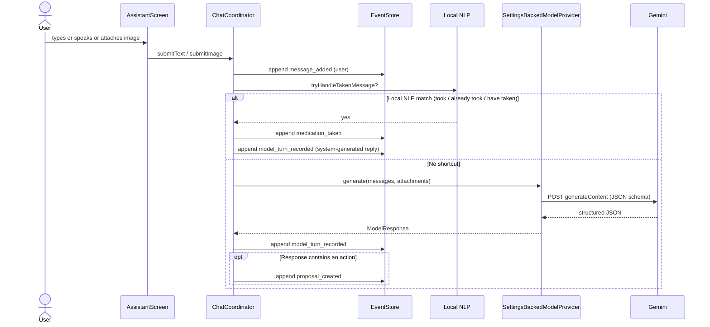
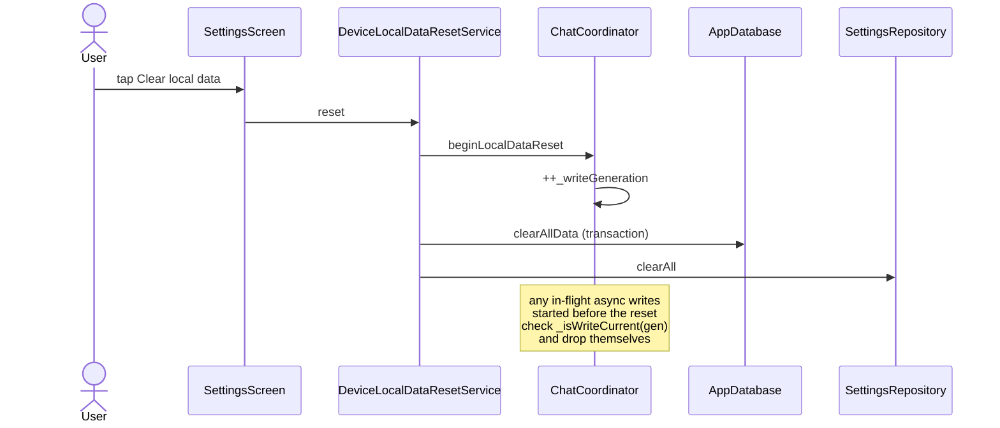

# CarePal — Architecture & Data Flow

> Onboarding doc for engineers new to the codebase. Read top-to-bottom once, then
> use it as a map. Every claim here is grounded in a specific file path so you
> can jump from concept to code.

---

## Table of contents

1. [Introduction](#1-introduction)
2. [Product shape](#2-product-shape)
3. [Technology stack](#3-technology-stack)
4. [Repository layout](#4-repository-layout)
5. [Entry points and bootstrap](#5-entry-points-and-bootstrap)
6. [Event sourcing and CQRS-lite](#6-event-sourcing-and-cqrs-lite)
7. [The data layer in detail](#7-the-data-layer-in-detail)
8. [State management](#8-state-management)
9. [Routing and the application shell](#9-routing-and-the-application-shell)
10. [The AI subsystem](#10-the-ai-subsystem)
11. [Settings, secrets, and BYO-AI](#11-settings-secrets-and-byo-ai)
12. [Multimodal input (voice and images)](#12-multimodal-input-voice-and-images)
13. [Feature tour](#13-feature-tour)
14. [Local data lifecycle](#14-local-data-lifecycle)
15. [Testing philosophy](#15-testing-philosophy)
16. [CI, CD, and release management](#16-ci-cd-and-release-management)
17. [Agent coding rules (rulesync)](#17-agent-coding-rules-rulesync)
18. [How this architecture enables the roadmap](#18-how-this-architecture-enables-the-roadmap)
19. [Where to look first](#19-where-to-look-first)
20. [Glossary](#20-glossary)

---

## 1. Introduction

CarePal is a local-first Flutter application for medication coordination. The
design goals in order of priority are:

1. **Safety** — medication is high-stakes. The app never silently mutates
   schedules. Every assistant-generated change must pass through a human
   review step before it becomes confirmed state.
2. **Privacy and resilience** — all data lives on-device by default. The app
   works without network access for everything except live AI requests.
3. **Auditability** — history is derived from an append-only event log.
   Corrections preserve the trail.
4. **Portability** — one codebase, five targets (iOS, Android, macOS, Web,
   Windows icon config).

The architecture that falls out of these goals has three load-bearing ideas:

- **An immutable event log as the source of truth** — every mutation is
  recorded as a `DomainEvent` wrapped in an `EventEnvelope`.
- **Projections as read models** — Drift tables are rebuilt from the event
  log to serve each screen; the UI reads via `StreamBuilder` on Drift's
  reactive `.watch()` queries.
- **Proposal-gated AI** — the assistant produces `Proposal` aggregates, never
  direct mutations. The user confirms, and the confirmation itself is an
  event.

Everything else (state management, routing, secrets, testing) follows from
those three ideas.

---

## 2. Product shape

Five top-level surfaces, all rendered inside a single `StatefulShellRoute` so
tab state persists across navigation:

| Surface | File | Purpose |
|---|---|---|
| **Today** | `lib/src/features/today/presentation/today_screen.dart` | Upcoming / due-now / overdue / taken reminders, daily summary, pending review card |
| **Assistant** | `lib/src/features/assistant/presentation/assistant_screen.dart` | Chat composer (text + voice + image), suggestion chips, pending proposal bar |
| **Calendar** | `lib/src/features/calendar/presentation/calendar_screen.dart` | Manual CRUD on confirmed schedules, per-time dosing, mark-taken flow |
| **History** | `lib/src/features/history/presentation/history_screen.dart` | Day-grouped activity feed derived from events; tap-to-correct on taken doses |
| **Settings** | `lib/src/features/settings/presentation/settings_screen.dart` | BYO-AI keys, model picker, schedule preferences, Danger Zone |

Two ways to change medication state:

1. **Manual edits** (Calendar) — go straight to command services.
2. **Assistant proposals** (Assistant) — a draft aggregate awaits explicit
   confirmation before it affects the confirmed schedule.

Adherence tracking is separate from schedule editing. Marking a dose as taken
emits a `medication_taken` event which carries both the scheduled dose being
completed and the actual taken time. Corrections emit
`medication_taken_corrected` and the projection keeps only the latest
correction, but the full trail survives in the event log.

---

## 3. Technology stack

### Runtime

- **Flutter** (stable channel) running on **Dart 3.10.4** (`pubspec.yaml`
  line 7). The app uses modern Dart features aggressively: sound null
  safety, sealed classes, pattern matching, records, exhaustive switch
  expressions.

### Dependencies (pubspec.yaml)

Runtime dependencies, with the role each one plays:

| Package | Role | Notes |
|---|---|---|
| `drift` | Reactive SQLite ORM | Source of truth for events and projections; powers `.watch()` streams |
| `drift_flutter` | Flutter integration for Drift | Native connection setup |
| `sqlite3` | Native SQLite bindings | Used with WAL journal mode for concurrent readers/writers |
| `go_router ^17` | Declarative routing | `StatefulShellRoute.indexedStack` for tabs |
| `flutter_secure_storage ^10` | OS-backed key storage | Keychain on iOS, Keystore on Android |
| `shared_preferences` | Lightweight key-value store | Fallback for platforms without secure storage; also non-sensitive settings |
| `flutter_dotenv` | Debug `.env` loader | Gated to debug builds via `Env` wrapper |
| `http` | Direct REST client | Talks to Gemini; no heavy SDK |
| `image_picker` | Photo capture | Prescription image input to Gemini |
| `mime` | MIME sniffing | Picks the right content type for `inline_data` parts |
| `url_launcher` | External URL handling | Documentation / external links |
| `web` | Web target support | JS interop plumbing |

Dev dependencies:

| Package | Role |
|---|---|
| `flutter_test`, `flutter_lints ^6` | Testing and static analysis |
| `build_runner`, `drift_dev` | Code generation for Drift schema (only) |
| `flutter_launcher_icons` | App icon generation across platforms |

**Deliberately absent**: Provider, Riverpod, Bloc, Freezed, json_serializable,
mockito. The team leaned on Dart language features and Flutter primitives
instead. This is not an accident — it keeps the dependency surface small,
makes upgrades cheap, and means every junior engineer can read the whole
state path without learning a framework.

### Target platforms

- **iOS** — TestFlight builds via Codemagic.
- **Android** — buildable; release signing path is commented out in
  `codemagic.yaml` until keys exist.
- **macOS** — first-class; `shared_preferences` used for key storage since
  secure storage isn't reliable on macOS without entitlement setup.
- **Web** — full Drift support via `sqlite3.wasm` + `drift_worker.js`
  bundled in `web/`.
- **Windows** — launcher icons configured only.

---

## 4. Repository layout

```
tokenizers/
├── lib/
│   ├── main.dart                   # Primary entry
│   ├── seed_demo_main.dart         # Alt entry: seed demo data, then bail
│   ├── env/
│   │   └── env.dart                # .env loader (debug-only)
│   └── src/
│       ├── app/                    # Shell, router, theme, DI scope
│       ├── bootstrap/              # Composition root + demo seeder
│       ├── core/
│       │   ├── domain/             # EventEnvelope, DomainEvent, scheduling types
│       │   ├── application/        # EventStore, ProjectionRunner, LocalDataResetGuard
│       │   └── model/              # ModelProvider interface (LLM-agnostic)
│       ├── data/                   # Drift DB, event store, projections,
│       │                           # API key stores, Gemini HTTP client
│       └── features/
│           ├── adherence/          # Pure-domain calculator + insights card
│           ├── assistant/          # Chat UI + voice + image
│           ├── calendar/           # Command service + manual CRUD + per-day view
│           ├── chat/               # ChatCoordinator + ConversationRepository
│           ├── history/            # Activity timeline
│           ├── home/               # Today-screen domain types
│           ├── proposals/          # Proposal/ProposalAction views
│           ├── settings/           # AiSettings, AiSettingsController
│           └── today/              # Daily reminders + progress
├── test/                           # Mirrors lib/src/ one-for-one
├── docs/                           # Plans, submission, this document
├── .rulesync/                      # Canonical agent rules (source of truth)
├── .claude/  .codex/  .cursor/ ... # Generated per-agent rule files
├── codemagic.yaml                  # CD pipeline (iOS TestFlight)
├── .github/workflows/              # CI + Release Please
└── pubspec.yaml
```

Every feature folder follows the same internal split:

```
features/<feature>/
├── application/     # Controllers, services, coordinators (stateful logic)
├── domain/          # Pure types, pure functions, no Flutter imports
└── presentation/    # Widgets, screens
```

`application/` may depend on `domain/`. `presentation/` may depend on both.
`domain/` depends on nothing outside the feature and `core/domain`. This
rule is what keeps unit tests fast and feature boundaries sharp.

---

## 5. Entry points and bootstrap

### Primary entry

`lib/main.dart` is the shortest file in the codebase by design:

```dart
Future<void> main() async {
  WidgetsFlutterBinding.ensureInitialized();
  await Env.load();
  final bootstrap = await createDemoAppBootstrap();
  runApp(TokenizersApp(bootstrap: bootstrap));
}
```

Three things happen:

1. **Env.load()** — `lib/env/env.dart` reads `.env` via `flutter_dotenv`,
   but only in debug builds. Release builds skip this entirely. The `Env`
   type exposes `Env.geminiApiKey` as a `String?`.
2. **createDemoAppBootstrap()** — the **composition root**. This is where
   every concrete implementation gets wired up. Nothing else in the app
   uses `new` on infrastructure classes.
3. **runApp(TokenizersApp(bootstrap: …))** — the bootstrap is passed down
   via an `InheritedWidget`, never through globals.

### Composition root

`lib/src/bootstrap/demo_app_bootstrap.dart` builds and returns an
`AppBootstrap` value. The sequence matters:



Important constants set here:

- `activityStreamId = 'thread-current'` — the single conversation thread
  ID. Multi-thread support is a future extension; the plumbing already
  takes an ID everywhere so nothing needs to be renamed when it arrives.

Every field on `AppBootstrap` is `final`. Services that need to be mutable
expose their own `ChangeNotifier`; the bootstrap itself is immutable.

### Alternative entry: demo seeder

`lib/seed_demo_main.dart` is a separate entrypoint invoked via
`flutter run -t lib/seed_demo_main.dart`. It loads the same bootstrap, then
runs `DemoDataSeeder` (in `lib/src/bootstrap/demo_data_seeder.dart`) which:

- Parses `assets/demo/demo_seed.txt` — a simple text DSL with record kinds
  (`THREAD`, `MESSAGE`, `PROPOSAL`, `SCHEDULE`, `RETIRED_SCHEDULE`, `TAKEN`,
  `CORRECTED_TAKEN`).
- Validates the entire parsed file before writing anything.
- Refuses to overwrite existing data unless `RESET_DEMO_DATA=true` is passed
  as a `--dart-define`.

The seeder exists purely so the demo dataset can be changed in a text file
without touching Dart code.

---

## 6. Event sourcing and CQRS-lite

This is the most important section of the document. If you understand this
section, every other piece of the architecture falls out naturally.

### The mental model

State is not stored directly. Instead:

1. Every user or system action **emits an event**.
2. Events are **appended immutably** to an event log.
3. Read models (projections) are **derived from the event log** by replay.
4. The UI reads from projections, not from events directly.

This is classic event sourcing plus CQRS-lite (Command-Query Responsibility
Separation). "Lite" because there is no distributed messaging, no saga
orchestrator, no process manager — just the local DB and a rebuild loop.



### The event envelope

Every event is wrapped in an `EventEnvelope` (`lib/src/core/domain/event_envelope.dart`):

```dart
class EventEnvelope<T extends DomainEvent> {
  final String eventId;            // UUID-ish, stable primary key
  final String aggregateType;      // 'conversation', 'medication', 'proposal'...
  final AggregateId aggregateId;   // which instance this event belongs to
  final T event;                   // { type: String, payload: Map }
  final DateTime occurredAt;       // wall-clock time
  final String? causationId;       // the event that caused this one
  final CorrelationId? correlationId; // workflow-wide grouping
  final EventActorType actorType;  // user | model | system
}
```

Notes on the envelope:

- **`actorType`** is a key property. It's how History can render "you did X"
  vs "the assistant proposed X" vs "the system marked X overdue", and it's
  what the audit trail needs to be defensible.
- **`causationId` and `correlationId`** enable reconstructing workflows.
  E.g. `message_added (user)` → `model_turn_recorded (model)` →
  `proposal_created (model)` → `proposal_confirmed (user)` can all share a
  correlation id so the whole arc is one query away.
- `DomainEvent` itself is a two-field type: `type: String` + `payload:
  Map<String, dynamic>`. Discriminator-based events keep the storage
  schema trivially flat and let new event types roll out without schema
  migrations.

### The EventStore interface

`lib/src/core/application/event_store.dart`:

```dart
abstract class EventStore {
  Future<void> append(EventEnvelope envelope);
  Future<List<EventEnvelope>> loadAll();
  Stream<List<EventEnvelope>> watchAll();
}
```

Three methods. That's it. This is deliberately minimal. Anything more (per-
aggregate streams, snapshotting, event filtering) is the consumer's job.

Concrete implementation: `DriftEventStore`
(`lib/src/data/drift_event_store.dart`) — JSON-encodes payloads, decodes on
read, orders by `(occurredAt, eventId)` for a stable total order even when
wall clocks tie.

### Commands → events

Command services are thin. Example:
`lib/src/features/calendar/application/medication_command_service.dart`.

When the user registers a new medication from the calendar screen, the
command service **emits two events as a pair**:

```
medication_registered      { medicationId, name }
medication_schedule_added  { medicationId, scheduleId, times, days, ... }
```

Renaming a medication during an update becomes `medication_schedule_stopped`
followed by `medication_schedule_added` with the new name. Stopping emits
`medication_schedule_stopped`. Marking a dose taken emits `medication_taken`;
correcting a taken time emits `medication_taken_corrected`.

The command service generates IDs deterministically from
`DateTime.now().microsecondsSinceEpoch + counter` — good enough for local
ordering, and the `eventId` is what you'd actually join on anyway.

### Events → projections

Projections are built by `DriftWorkspace`
(`lib/src/data/drift_workspace.dart`) in two stages.

**Stage 1: Pure reduction.** `ProjectionState.fromEvents(events)` in
`lib/src/data/projection_state.dart` is a pure function — it takes a list
of envelopes and returns an immutable `ProjectionState` (a record of
maps: threads, messages, proposals, medications, schedules, times,
taken-by-dose-key). No Drift. No IO. No Flutter. This is the most
heavily unit-tested file in the repo because every bug in here would
manifest as a UI bug the test suite couldn't explain.

**Stage 2: Truncate-and-rebuild.** `DriftWorkspace.rebuild()` opens a
transaction, `DELETE`s all projection rows, then writes the new state
from `ProjectionState`. Simple, correct, and fine at current scales.

### The rebuild loop

`DriftWorkspace` subscribes to `eventStore.watchAll()` in its constructor
and calls `_requestRebuild()` on each emission. `_requestRebuild` uses a
**queue-collapse pattern**:

```
_rebuildRunning  true/false
_rebuildQueued   true/false

request:
  if running, set queued=true and return
  set running=true
  loop:
    do the rebuild
    if queued: clear queued, loop
    else break
  set running=false
```

This means bursts of events (common during seed, bulk import, or rapid
taken/untaken clicks) produce at most one in-flight rebuild plus one
queued rebuild, regardless of how many events arrive.

### Reads

Projections expose reactive streams via Drift's `.watch()`:

| Stream | Used by |
|---|---|
| `watchCalendarEntriesForDay` | Calendar screen, Today screen |
| `watchMessages(streamId)` | Assistant screen |
| `watchPendingProposal(streamId)` | Assistant, Today (pending review card) |
| `watchThreads()` | Assistant (future multi-thread) |
| `watchActiveSchedules` | Calendar management |

Each of these yields a fresh list any time the underlying table changes.
Screens subscribe via `StreamBuilder`. There is no manual "reload" button
anywhere in the app because there doesn't need to be one.

### Why this matters for new engineers

- **Bugs are reproducible.** Given the same event log, the projection is
  deterministic. `ProjectionState.fromEvents([...])` in a unit test is how
  most state bugs get diagnosed.
- **New features often don't require schema changes.** Heatmaps, streaks,
  per-medication stats — all of these are new projections over the same
  events.
- **The audit trail is free.** The event log *is* the audit trail.
- **Sync is a data-layer concern.** Because state is append-only with
  stable envelope metadata, future sync (CRDT or otherwise) slots in
  behind `EventStore` without touching the UI.

---

## 7. The data layer in detail

### AppDatabase

`lib/src/data/app_database.dart`. Drift database with these tables (all
single-source, no joins-across-databases cleverness):

| Table | Purpose |
|---|---|
| `EventLog` | The immutable event log; text PK `eventId` |
| `ConversationThreadsTable` | Projection: chat threads |
| `MessagesTable` | Projection: chat messages |
| `ProposalsTable` | Projection: drafts pending review |
| `ProposalActionsTable` | Projection: individual actions within a proposal |
| `MedicationsTable` | Projection: known medications |
| `MedicationSchedulesTable` | Projection: active schedules |
| `MedicationScheduleTimesTable` | Projection: per-schedule dose times |

`schemaVersion = 1`. The first migration will be interesting; a rehearsal
against a seeded demo DB before that day matters is wise.

Platform differences:

- **Native:** connection sets `pragma journal_mode = WAL` and
  `shareAcrossIsolates: true` — concurrent reader/writer safety, important
  because Drift uses a background isolate for queries.
- **Web:** uses `sqlite3.wasm` + `drift_worker.js` bundled as assets.
  `web/` contains these files. Drift handles the handoff; the API surface
  is identical.

`clearAllData()` is a single `Transaction` that truncates every table. Used
by the Danger Zone reset flow.

### DriftEventStore

`lib/src/data/drift_event_store.dart`. Trivial: JSON-encode the payload on
write, decode on read, select `ORDER BY occurredAt ASC, eventId ASC` so
ties don't produce non-deterministic replay. The `watchAll()` stream is
just Drift's `.watch()` on the same query.

### DriftWorkspace

`lib/src/data/drift_workspace.dart`. Implements **three interfaces**:

- `ConversationRepository` (from `features/chat/application/`)
- `MedicationRepository` (from `features/calendar/application/`)
- `ProjectionRunner` (from `core/application/`)

One class wearing three hats feels heavy until you realise they all share
state (the projection tables) and lifecycle (rebuilt atomically as a unit).
Splitting it into three classes would just create coordination problems.

The workspace's public API is two surface types:

- **`watch*` methods** — read-side streams for UI.
- **`rebuild()`** — idempotent, triggered by `watchAll()` subscription and
  by the bootstrap once at startup.

Everything else is private.

### API key storage

`lib/src/data/api_key_store.dart` + `platform_api_key_store.dart`. Four
implementations behind one interface:

```
ApiKeyStore
├── SecureStorageApiKeyStore       (iOS, Android)
├── SharedPreferencesApiKeyStore   (web, macOS)
├── DebugApiKeyStore               (reads Env.geminiApiKey)
└── FallbackApiKeyStore            (primary + fallback composite)
```

The bootstrap composes them as:

```
FallbackApiKeyStore(
  primary:   platform-specific writable store,
  fallback:  DebugApiKeyStore(readValue: () => Env.geminiApiKey),
)
```

Reads hit the primary first and fall through to `.env` only if nothing is
stored. Writes only ever go to the primary. This is why Settings can
accurately report "Saved on this device" vs "Loaded from debug .env" vs
"No key stored" — the store tells it which source resolved the key.

### Gemini model provider

`lib/src/data/gemini_model_provider.dart`. Direct HTTP to
`generativelanguage.googleapis.com/v1beta/models/{model}:generateContent`
with three notable features:

1. **System prompt enforces the safety rule**: *"Never mutate current
   schedules directly. Always propose actions for explicit user review."*
   This rule is duplicated in the UI (which never exposes a mutate-now
   path for AI output), but enforcing it at both layers is defence in
   depth.
2. **Structured output via `responseJsonSchema`** — the response MIME is
   pinned to `application/json` and the schema constrains the shape. The
   `action` field is an enum: `add`, `update`, `stop`,
   `request_missing_info`. Parsing is a straight `jsonDecode`.
3. **Multimodal** — image attachments are sent as `inline_data` parts
   with MIME sniffed via the `mime` package.

Temperature is pinned low (0.2) because this is a scheduling assistant,
not a creative writing tool.

### SettingsBackedModelProvider

`lib/src/data/settings_backed_model_provider.dart` is a thin wrapper that
resolves **provider + key + model at request time** from
`AiSettingsController`. This matters because:

- The user can change the model mid-conversation.
- The user can clear their key from Settings. If a request was already
  in flight, it'll complete; new requests will throw `StateError`.
- Multi-provider support (Gemma, future others) is a matter of extending
  this resolver, not changing call sites.

---

## 8. State management

No third-party state library. Three Flutter primitives, used
unapologetically:

| Primitive | Used for | Typical example |
|---|---|---|
| `InheritedWidget` (`AppScope`) | Downward DI of bootstrap services | `AppScope.of(context).chatCoordinator` |
| `ChangeNotifier` + `ListenableBuilder` | Mutable controller state | `AiSettingsController`, `VoiceInputController` |
| `StreamBuilder` over Drift `.watch()` | Reactive read models | Today, Calendar, Assistant screens |

### AppScope

`lib/src/app/app_scope.dart` is a minimal `InheritedWidget`:

```dart
class AppScope extends InheritedWidget {
  const AppScope({required this.bootstrap, required super.child, super.key});
  final AppBootstrap bootstrap;

  static AppBootstrap of(BuildContext context) {
    final scope = context.dependOnInheritedWidgetOfExactType<AppScope>();
    return scope!.bootstrap;
  }

  @override
  bool updateShouldNotify(AppScope oldWidget) => bootstrap != oldWidget.bootstrap;
}
```

That's the entire DI container. Screens call `AppScope.of(context)` to get
the bootstrap, then pull the services they need. There is no service
locator, no global, no reflection. Because `AppBootstrap` is immutable,
`updateShouldNotify` almost always returns `false` and rebuilds are not
triggered by scope alone.

### Controllers

Controllers are `ChangeNotifier` subclasses with public getter state and
void async methods that call `notifyListeners()`. Two good examples:

- `lib/src/features/settings/application/ai_settings_controller.dart`
  exposes `settings`, `isLoaded`, `isSavingApiKey`, `errorMessage`,
  `configurationError` etc. The Settings screen wraps each section in
  `ListenableBuilder(listenable: controller, builder: ...)`.
- `lib/src/features/assistant/application/voice_input_controller.dart`
  manages locale fallback, partial-vs-final transcripts, and a
  committed-vs-active buffer for continuous dictation.

Controllers never expose mutable state directly. They expose getters and
accept void methods. External callers cannot mutate internal fields.

### StreamBuilders

Every screen that reads projection state does so through `StreamBuilder`
over a Drift `.watch()` query. Example from the Today screen:

```dart
StreamBuilder<List<MedicationCalendarEntry>>(
  stream: medicationRepository.watchCalendarEntriesForDay(date),
  builder: (context, snapshot) { ... },
)
```

Three nested `StreamBuilder`s appear on the Today screen (calendar
entries, raw events for adherence calc, pending proposal). This is fine —
Dart's build pipeline is efficient and three subscriptions is nothing.

### Why not Provider / Riverpod / Bloc?

Because this codebase doesn't need them. The DI graph is shallow (one
composition root, values flow through one `InheritedWidget`). The mutable
state surfaces are small (a handful of controllers). The read-side is
already reactive thanks to Drift. Adding a framework would be weight
without benefit. If the app grows and that calculus changes, the swap is
mechanical — controllers already have the shape of view models.

---

## 9. Routing and the application shell

### The router

`lib/src/app/app_router.dart` builds a `GoRouter` with a single
**`StatefulShellRoute.indexedStack`** containing five branches: `/today`,
`/assistant`, `/calendar`, `/history`, `/settings`.

Why `StatefulShellRoute.indexedStack`?

- Each branch keeps its own `Navigator`, so scrolling on History and
  bouncing to Assistant doesn't reset History's scroll position.
- `indexedStack` keeps all branches alive simultaneously, so
  `StreamBuilder` subscriptions on a non-visible tab stay warm and the
  tab shows fresh data instantly on re-selection.
- `NoTransitionPage` on each branch — a tab app should feel
  instantaneous, not slide.

### The shell

`lib/src/app/app_shell.dart` implements the responsive chrome around the
branch. Key behaviours:

- **Breakpoint at 900px.** Below that, `NavigationBar` (bottom tabs).
  Above, `NavigationRail` (side rail). Same widget tree, different
  chrome.
- **Configuration banner** — when `configurationError != null` and the
  Assistant tab is active, a banner appears prompting the user to
  configure an API key. Other tabs are not interrupted. The banner uses
  `ListenableBuilder` on `aiSettingsController` so it updates the moment
  a key is saved.
- **Shell state is stateless.** The navigation index comes from the
  router, not local state.

### Deep linking

`go_router` supports path parameters and deep links natively. Today only
top-level tabs are deep-linkable; adding per-medication or per-day deep
links would be a matter of adding nested `GoRoute`s under the relevant
branch.

---

## 10. The AI subsystem

### The safety contract

The assistant is a **draft producer**, not an authority. Its output is a
proposal that the user reviews before any confirmed state changes. This
rule is enforced in three places:

1. **Prompt** — the Gemini system prompt explicitly says so.
2. **Schema** — the response schema's `action` enum has no
   "apply immediately" option.
3. **UI** — the assistant screen's only path to confirmed-state mutation
   is the proposal review bar, which emits `proposal_confirmed` + the
   corresponding medication events.

### ChatCoordinator

`lib/src/features/chat/application/chat_coordinator.dart` is the core of
the AI subsystem. It's substantial — several hundred lines — because it
coordinates:

- User turns (text, image).
- Local NLP shortcuts (no-model-needed paths).
- Model turns with structured-output parsing.
- Proposal creation, confirmation, dismissal, supersession.
- Error handling and recording.
- Data-reset cancellation.

#### Submit flow



#### Local NLP shortcut

`_tryHandleTakenMessage` matches phrases like "I took ibuprofen", "I
already took paracetamol", "I have taken my morning meds". When it
matches, it writes a `medication_taken` event directly and fabricates a
model turn confirming the action. The user's turn is never sent to the
model. This is:

- **Cheap** (no API call).
- **Offline-correct** (works without network).
- **Conservative** — the regexes only match common patterns; ambiguous
  phrasing falls through to the model.

#### Error handling

If the model call fails (network, auth, rate limit, bad JSON), the
coordinator still records the user's message turn, then records a model
turn with the error captured in the payload. The UI can then render "I
couldn't reach the assistant" without losing the user's input. History
will show exactly what happened.

#### Proposals

When the model response contains an actionable instruction, the
coordinator emits a `proposal_created` event with the proposed actions
attached. `DriftWorkspace` projects this into the `ProposalsTable` and
`ProposalActionsTable`. `watchPendingProposal(streamId)` exposes it to
the Assistant screen (and the Today pending-review card).

On confirmation, the coordinator:

1. Reads the proposal (possibly with user edits applied).
2. Emits `proposal_confirmed`.
3. Emits the corresponding medication events: `medication_registered`,
   `medication_schedule_added`, `medication_schedule_updated`, or
   `medication_schedule_stopped`, per action type.
4. For updates where the medication name changed, emits a
   `_stopped` + `_added` pair.

Dismissing emits `proposal_cancelled`. Submitting a new proposal before
confirming an existing one emits `proposal_superseded` on the old one.

### The ModelProvider interface

`lib/src/core/model/model_provider.dart` is the abstraction that makes
the AI subsystem portable. `GeminiModelProvider` is one implementation;
`SettingsBackedModelProvider` is a dispatcher. An eventual
`GemmaModelProvider` for on-device inference slots in the same way.

---

## 11. Settings, secrets, and BYO-AI

### Settings surface

`lib/src/features/settings/domain/ai_settings.dart` defines:

- `AiProvider` — currently `gemini` only.
- `GeminiModel` — `gemini25Flash`, `gemini3FlashPreview`,
  `gemini31ProPreview`, each with `wireValue`, `apiModelName`, `label`,
  `description`.
- `ApiKeyStorageKind` — `secureStorage`, `sharedPreferencesFallback`.
- `ApiKeySource` — `none`, `stored`, `debugEnv`.
- `AiSettings` — immutable snapshot with `copyWith`,
  `configurationError` getter.
- `MedicationSchedulePreferences` — default anchor times used when
  dosing is underspecified.

### Persistence

`lib/src/data/local_ai_settings_repository.dart` reads/writes these via
`SharedPreferences` for non-sensitive fields and via the layered
`ApiKeyStore` for the API key itself.

### AiSettingsController

`lib/src/features/settings/application/ai_settings_controller.dart` is the
`ChangeNotifier` that owns the mutable settings state. It exposes
per-field saving flags (`isSavingApiKey`, `isSavingModel`,
`isSavingSchedulePreferences`) so the UI can render partial loading
states without locking the whole screen.

### The configuration error

`AiSettings.configurationError` returns `null` if configured and a nudge
string otherwise. `AppShell` uses this to show the configuration banner;
`AssistantScreen` uses it to disable the composer.

---

## 12. Multimodal input (voice and images)

### Voice

`lib/src/features/assistant/application/speech_to_text_service.dart` uses
**platform-conditional imports** to pick an implementation at compile
time:

- Web gets a `dart:js_interop` implementation.
- Native gets a `dart:io`-based implementation.
- Everywhere else falls back to `UnsupportedSpeechToTextService` (a
  no-op).

The events are a **sealed class hierarchy**:

```dart
sealed class SpeechToTextEvent { }
class SpeechToTextStatusEvent extends SpeechToTextEvent { final SpeechStatus status; }
class SpeechToTextTranscriptEvent extends SpeechToTextEvent { ... partial/final ... }
class SpeechToTextErrorEvent extends SpeechToTextEvent { ... }
```

Sealed classes mean consumers can use exhaustive switch expressions with
no default branch. New event types are a compile error everywhere they
need to be handled — exactly what you want.

`VoiceInputController` (ChangeNotifier) handles:

- Locale fallback (try user's locale, then default).
- Partial vs final transcript distinction.
- Committed-vs-active buffer join, so a user can pause and resume
  dictation without losing what they said.
- A "looks-like-continuation" heuristic for deciding whether the next
  partial should append or replace.

**Privacy property**: raw audio stays on-device. Only the
user-reviewed transcript is ever sent to Gemini.

### Images

`image_picker` provides both camera and gallery paths. The Assistant
screen keeps a `_PendingImageAttachment` value type until submission,
where it's MIME-sniffed via `mime` and attached to the model request as
`inline_data`. The attachment appears as a preview chip in the composer
before submission.

---

## 13. Feature tour

### Today (`features/today/`)

Renders the selected day as four buckets: **due now**, **up next**,
**overdue**, **taken**. The screen runs three `StreamBuilder`s in
parallel:

1. `watchCalendarEntriesForDay` → reminders.
2. `eventStore.watchAll` → raw events for adherence calculation.
3. `watchPendingProposal` → pending review card.

Pulls together `_TodaySummary` value type for the daily progress summary
card. Adherence progress is computed per day by
`calculateAdherence` in the adherence feature.

### Assistant (`features/assistant/`)

Chat composer with three input modes: text, voice (bottom sheet), image
(camera or gallery). `_PendingProposalActionBar` shows at the bottom when
a proposal is pending and offers review/dismiss. The composer is
disabled when `configurationError` is set.

The chat list uses a normal `ListView` (not `.builder`) because the
message count per thread is small. If multi-thread arrives and users
have hundreds of messages, this becomes `ListView.builder`.

### Calendar (`features/calendar/`)

Manual schedule management. Uses `MedicationCommandService` directly for
CRUD (no AI in the write path). Per-time dosing is modelled as a
`MedicationScheduleTimesTable` row per time-of-day entry. The
"mark taken" flow picks both the scheduled dose being completed and the
actual time — this allows "I took my 8am dose at 9am" to be recorded
truthfully.

### History (`features/history/`)

The activity feed. It is **not** a raw event log render — it's filtered
by `_shouldIncludeInHistory` in
`lib/src/features/history/domain/history_timeline_models.dart`:

- Filters out `thread_started` (noise).
- Filters out all `proposal_*` events except in context (proposals are
  surfaced via their paired model turn, not standalone).
- Suppresses model turns that are paired with `proposal_created` (so chat
  doesn't double up with draft creation).
- Keeps only the **latest** `medication_taken` or
  `medication_taken_corrected` per dose key, while the event log itself
  preserves every correction.

Entries are grouped by day and sorted by `occurredAt` desc with a kind
tiebreaker for stable ordering.

Tap-to-correct: tapping a taken entry opens a time picker and emits
`medication_taken_corrected`.

### Adherence (`features/adherence/`)

`lib/src/features/adherence/domain/adherence_calculator.dart` is a pure
function over events:

- 7-day lookback window.
- Builds a set of "dose keys" (medication + scheduled time) from
  `medication_taken` events, resolving corrections to keep only the
  latest.
- Skips upcoming doses for today (can't fail what isn't due yet).
- Computes per-medication and overall daily adherence, plus current
  streak.

The Insights card on Today surfaces this.

### Proposals (`features/proposals/`)

Domain-only feature: `ProposalStatus` (`pending`, `confirmed`,
`cancelled`, `superseded`), `ProposalActionType` (with `wireValue`
strings like `add_medication_schedule`), `ProposalView` and
`ProposalActionView` view models. The actual persistence and projection
of proposals lives in the data layer; this feature holds the
user-facing types and small helpers like `isConfirmable`.

### Settings (`features/settings/`)

BYO-AI configuration, schedule preferences, Danger Zone. The Danger Zone
action calls `localDataResetService.reset()` which cascades through
`ChatCoordinator.beginLocalDataReset()` → `AppDatabase.clearAllData()` →
`aiSettingsRepository.clearAll()`.

---

## 14. Local data lifecycle

### The reset flow

`lib/src/data/device_local_data_reset_service.dart`:



### The write-generation token

`ChatCoordinator` implements `LocalDataResetGuard`
(`lib/src/core/application/local_data_reset_guard.dart`). It maintains a
private `_writeGeneration` counter. Every async step that would write an
event first captures the current generation and, before writing, calls
`_isWriteCurrent(capturedGeneration)`. If the generation has advanced
because the user hit reset, the step quietly returns without writing.

This handles the edge case where:

1. User asks the assistant something.
2. Gemini takes 4 seconds to respond.
3. During those 4 seconds, the user taps "Clear local data".
4. The response arrives.

Without the guard, the response would write into a fresh DB. With the
guard, it's dropped. The user's intent ("I want a clean slate") is
preserved.

### Seeding

Demo data lives in `assets/demo/demo_seed.txt`. The format is a simple
text DSL parsed by `DemoDataSeeder`. Running the seed entrypoint:

```
flutter run --dart-define-from-file=.env \
  -t lib/seed_demo_main.dart
```

The seeder refuses to overwrite existing data unless
`--dart-define=RESET_DEMO_DATA=true` is passed. After seeding, stop the
seed run and launch the normal app on the same target.

---

## 15. Testing philosophy

### Layout

`test/` mirrors `lib/src/` one-for-one:

```
test/
├── app/                           # MaterialApp shell widget tests
├── bootstrap/                     # Demo data seeder tests
├── core/domain/                   # Medication scheduling logic
├── data/                          # API key store, data reset, AI settings
├── env/                           # Environment configuration tests
└── features/
    ├── adherence/                 # Calculator and insights card
    ├── assistant/                 # Voice input controller and screen
    ├── calendar/                  # Command service, time inference, screen
    ├── chat/                      # Chat coordinator
    ├── history/                   # Timeline models and screen
    ├── home/                      # Reminder models
    ├── settings/                  # Settings screen
    └── today/                     # Today screen
```

### Priorities

1. **Pure-domain tests first.** `ProjectionState.fromEvents`,
   `AdherenceCalculator`, `HistoryTimelineModels`, and the medication
   scheduling logic are all heavily covered because they're the highest
   leverage and the cheapest to run.
2. **Widget tests per screen** for golden-path rendering.
3. **Application-layer tests** for `ChatCoordinator`,
   `MedicationCommandService`, `AiSettingsController`.
4. **Platform-sensitive code is isolated behind interfaces** so tests
   supply in-memory fakes: `EventStore`, `ModelProvider`,
   `ConversationRepository`, `MedicationRepository`, `ApiKeyStore`,
   `SpeechToTextService`.

### No mocking framework

The codebase does not depend on `mockito` or `mocktail`. Test doubles
are hand-written fakes that implement the relevant interface. This is a
deliberate choice:

- Interface-driven fakes evolve with the interface; mocks tend to
  drift.
- Test-only code is easier to read when it's plain Dart.
- Fakes can encode invariants (e.g. a fake event store that asserts
  event ordering) that mocks can't.

### Running tests

`make test` or `flutter test`. CI runs this on every PR to `main`.

---

## 16. CI, CD, and release management

### CI

`.github/workflows/ci.yml` runs on every push and PR to `main`:

- `flutter format --set-exit-if-changed` (via `make fmt`).
- `flutter analyze` (via `make lint`).
- `flutter test` (via `make test`).

### CD

`codemagic.yaml` drives iOS builds:

- Triggered on tags (Release Please creates these).
- Runs on M2 Mac Mini (per recent commit).
- iOS build, signing, TestFlight upload — all enabled.
- Android steps commented out until Play credentials exist.

### Release Please

`.github/workflows/release_please.yml` runs on pushes to `main` and
manual dispatch.

- Driven by **Conventional Commits**: `feat:`, `fix:`, `chore:`, etc.
- `release_please_config.json` uses the Dart releaser for the
  `tokenizers` package.
- Release metadata sourced from `pubspec.yaml` and `CHANGELOG.md`.
- Output: a PR that bumps `pubspec.yaml` version and updates
  `CHANGELOG.md`. Merging that PR cuts a release tag, which triggers
  Codemagic.

Also present:
`.github/workflows/release-with-bumped-patch-version.yaml` as a manual
patch-bump entrypoint.

Both workflows require the `RELEASE_PLEASE_COMMIT_TOKEN` GitHub secret.

### Secrets hygiene

- `.gitignore` excludes `**/.env`.
- `.rulesync/.aiignore` excludes `.env*` from AI agent context (belt and
  braces).
- Release builds do not read `.env` — keys come from the in-app BYO-AI
  flow or CI secrets.
- The repo ships `.env.example` only.

---

## 17. Agent coding rules (rulesync)

This repo ships **structured coding rules and Flutter skills for every
major AI coding agent platform**, generated from a single canonical
source via [rulesync](https://github.com/nichochar/rulesync).

| Path | Platform |
|---|---|
| `AGENTS.md` | Generic agent rules |
| `.agents/` | Generic agent skills |
| `CLAUDE.md` | Claude Code (Anthropic) |
| `.claude/` | Claude Code settings/skills |
| `.codex/` | Codex CLI (OpenAI) |
| `.cursor/` | Cursor |
| `.github/copilot-instructions.md` | GitHub Copilot |
| `.opencode/` | OpenCode |

Canonical source: `.rulesync/rules/` and `.rulesync/skills/`. Regenerate
with:

```
make rules-generate
```

The rules themselves codify the operating guidelines in `CLAUDE.md`:
read-first, small changes, explicit assumptions, Conventional Commits,
no premature abstraction, respect brownfield context. Any new pattern
or rule should be added to `.rulesync/` and regenerated, not dropped
into a single agent's rule file.

---

## 18. How this architecture enables the roadmap

The README's "Up Next" section lists three items. Each maps cleanly onto
existing seams.

### Offline Gemma

The assistant depends only on the `ModelProvider` interface
(`lib/src/core/model/model_provider.dart`). `SettingsBackedModelProvider`
already knows how to dispatch based on settings. Adding Gemma is:

1. A new `GemmaModelProvider` implementation (on-device inference).
2. A new value in the `AiProvider` enum.
3. A toggle in the Settings UI.

No event schema changes. No projection changes. No coordinator changes.
No UI flow changes. The proposal-review contract is provider-agnostic.

### Richer multimodal intake

Voice and image are already first-class inputs flowing through
`ChatCoordinator.submitText` and `ChatCoordinator.submitImage`. Improving
quality is upstream work:

- Better speech models plug into the `SpeechToTextService` factory.
- Better image preprocessing is a function call before `inline_data`.
- Prescription parsing could get its own `ProposalActionType` without
  touching existing flows.

### Tighter proposal UX

Proposals already have their own aggregate with their own status
machine (`pending → confirmed / cancelled / superseded`) and their own
projection stream. UI can evolve freely:

- Inline editing of proposed actions.
- Diff views ("what will change").
- Summary previews.
- Per-action confirm/reject.

All of it reads from `ProposalView` / `ProposalActionView`. The
`isConfirmable` flag and `superseded` status already handle the "user
started a new draft" case.

### Implicit future: sync / multi-device

Because state is an append-only event log with stable envelope metadata
(`eventId`, `correlationId`, `occurredAt`, `actorType`), adding sync is
a pure data-layer concern. The UI keeps reading projections; only the
`EventStore` implementation gets a remote backend or CRDT shim. No
screen knows or cares.

### Implicit future: compliance / audit

The event log **is** the audit trail. `medication_taken_corrected`
preserves history. `actorType` distinguishes user / model / system
actions. Drafts and confirmations are separate event types. Any
compliance story can be reconstructed from the log alone without
forensic archaeology.

---

## 19. Where to look first

If you have 30 minutes, read these five files in order. You'll
understand 80% of the codebase:

1. `lib/main.dart` — entry point.
2. `lib/src/bootstrap/demo_app_bootstrap.dart` — composition root. See
   every wiring decision in one place.
3. `lib/src/core/domain/event_envelope.dart` and
   `lib/src/core/domain/domain_event.dart` — the shape of state.
4. `lib/src/data/projection_state.dart` — the pure reducer that turns
   events into read models.
5. `lib/src/features/chat/application/chat_coordinator.dart` — the AI
   safety story.

If you have a full afternoon, add:

6. `lib/src/data/drift_workspace.dart` — the rebuild loop and the three
   repository interfaces.
7. `lib/src/data/gemini_model_provider.dart` — structured output, system
   prompt, multimodal.
8. `lib/src/features/calendar/application/medication_command_service.dart`
   — the write path for manual edits.
9. `lib/src/app/app_router.dart` and `lib/src/app/app_shell.dart` —
   navigation chrome.
10. `lib/src/features/history/domain/history_timeline_models.dart` — the
    filter logic that turns raw events into a user-facing feed.

### Common newbie pitfalls

- **Don't mutate Drift tables directly.** Writes go through command
  services → `EventStore.append`. The projection tables are rebuilt
  from events; a direct write will disappear on the next rebuild.
- **Don't add a new field to `AppBootstrap` without threading it all
  the way up from `createDemoAppBootstrap`.** The bootstrap is the only
  place that constructs concrete infrastructure.
- **Don't call `DateTime.now()` deep inside domain code.** Either take
  a clock parameter or generate the timestamp at the command-service
  boundary. The domain layer should be time-parameterised for tests.
- **Don't create a third-party state management dependency.** If you
  feel the need, write up what's missing and raise it; the current
  answer is a `ChangeNotifier` or a `StreamBuilder`.
- **Don't silently mutate schedules from AI output.** Every AI-driven
  change must go through a `Proposal`. This is the whole product.

---

## 20. Glossary

- **Aggregate** — a logical entity whose state is derived from a stream
  of events keyed by `aggregateId`. E.g. a conversation thread, a
  medication, a proposal.
- **ChangeNotifier** — Flutter's built-in observable. Pairs with
  `ListenableBuilder`.
- **Command service** — a class whose job is to turn user actions into
  events appended to the event store. Example:
  `MedicationCommandService`.
- **CQRS** — Command-Query Responsibility Segregation. Writes
  (commands) and reads (queries) use different models.
- **DomainEvent** — a two-field type (`type: String`, `payload: Map`)
  representing something that happened.
- **Drift** — Dart's reactive SQLite ORM. Provides `.watch()` streams.
- **EventEnvelope** — `DomainEvent` plus store metadata (ids, times,
  actor, causation, correlation).
- **EventStore** — append-only store for `EventEnvelope`s. Implemented
  by `DriftEventStore`.
- **InheritedWidget** — Flutter's DI/propagation primitive. Used here
  via `AppScope`.
- **LocalDataResetGuard** — interface for services that need to drop
  in-flight writes after a local data reset. Implemented by
  `ChatCoordinator`.
- **Projection** — a read model derived from replaying events. Stored
  in Drift tables rebuilt by `DriftWorkspace`.
- **Proposal** — a draft medication change produced by the assistant,
  awaiting explicit user confirmation. Status machine:
  `pending → confirmed / cancelled / superseded`.
- **rulesync** — tool that generates per-agent rule files (Claude Code,
  Codex, Cursor, Copilot, OpenCode) from a canonical source.
- **StatefulShellRoute** — `go_router`'s route type for tabbed UIs that
  preserve per-tab navigation state.
- **Write-generation token** — a monotonic counter in `ChatCoordinator`
  used to drop async writes that started before a local data reset.
